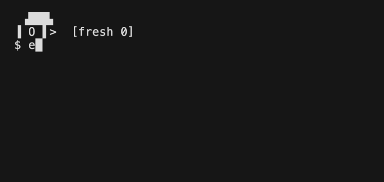

# canary

a tiny pixel-art bird that lives in your shell prompt and slowly wilts the
longer you grind. **for fun** — a nudge to step away, not a science.

no color. no internet. no dependency. just UTF-8 block art + your shell.

## bird

```
 ▗███▖        ▗███▖♪       ▗███▖        ▗▓▓▓▖        ▗░░░▖
▐ O ▌>       ▐ ^ ▌>       ▐ - ▌>       ▐ ~ ▌>       ░ x ▌v
 fresh        chirpy       tired        worn         dead
```

in your real prompt it perches just above the line you type:

```
 ▗███▖
▐ O ▌>
❯ git status
```

bird wilts from: time at the shell, how many commands, how long they are.
late night counts extra. dead bird = go rest.

## demo



regenerate any time with [vhs](https://github.com/charmbracelet/vhs):

```sh
vhs demo.tape
```

## install

**Homebrew** (cleanest):

```sh
brew install thousandflowers/tap/canary
```

or one line:

```sh
curl -fsSL https://raw.githubusercontent.com/thousandflowers/canary/main/install.sh | sh
```

**prefer to read before you run?** (good instinct — `curl | sh` runs code
sight-unseen.) clone, inspect, then install locally:

```sh
git clone https://github.com/thousandflowers/canary
cd canary
less install.sh canary.sh      # look first
sh install.sh
```

then open a new shell. the bird appears above your prompt.

## tame the bird

```sh
CANARY_DISABLED=1       # bird sleeps (no output)
CANARY_RESET=1          # fresh session, bird young again
CANARY_SHOW_SCORE=1     # show the fatigue number 0–100

# quieter: only show the bird once it actually matters
CANARY_MIN_SCORE=46     # draw only at tired+ (0 = always, default; 71 = worn+)

# idle-aware: coffee/lunch breaks don't age the bird — only active work counts
CANARY_IDLE_THRESHOLD=300  # a gap longer than this (sec) stops the clock (default 300 = 5 min)

# circadian penalty — defaults assume a daytime schedule.
# night owl? tune or switch it off:
CANARY_NIGHT_START=22   # hour the penalty starts (default 22)
CANARY_NIGHT_END=7      # hour it ends            (default 7)
CANARY_NIGHT_MULT=130   # penalty percent: 100 = off, 130 = ×1.3 (default)
```

## the "fatigue" number

```
score = minutes/3 + commands/2 + avg_cmd_len/10        (capped at 100)
      = (min/120·40) + (count/80·40) + (avglen/200·20)
night   × CANARY_NIGHT_MULT/100

0–20 fresh   21–45 chirpy   46–70 tired   71–90 worn   91–100 dead
```

*minutes* = **active** time only: gaps longer than `CANARY_IDLE_THRESHOLD`
(default 5 min) are treated as breaks and don't count. leave the terminal
open all afternoon — the bird only ages while you actually work.

**honest caveat:** this is a crude *activity* proxy, not real cognitive load.
a deep flow session and a frustrating debug both look identical to it. treat
the bird as a playful timer, not a doctor.

## Claude Code statusline

canary can perch next to caveman's `[CAVEMAN]` badge in Claude Code's status line:

```
[CAVEMAN] ▗███▖ tired · 58m · 41p
          ▐ - ▌>
```

`install.sh` wires this automatically (needs `jq`): it drops `canary-statusline.sh`
into `~/.canary/` and merges a `statusLine` command into
`$CLAUDE_CONFIG_DIR/settings.json` (default `~/.claude`). If a status line already
exists (e.g. caveman's), canary is **appended** to it, not replacing it — Claude
Code allows only one status line command, and caveman emits no trailing newline so
the bird lands right beside the badge. A backup is saved to `settings.json.canary.bak`.

The status line reads `~/.canary/canary-state`, refreshed by canary's shell hook
every command, so the prompt bird and the status line always agree.
`sh uninstall.sh` removes only canary's segment, leaving the rest intact.

## uninstall

```sh
sh uninstall.sh
```

bird gone. rc cleaned. `~/.canary` removed.

## shell

zsh, bash, fish. UTF-8 terminal required.

## license

MIT. see LICENSE.
