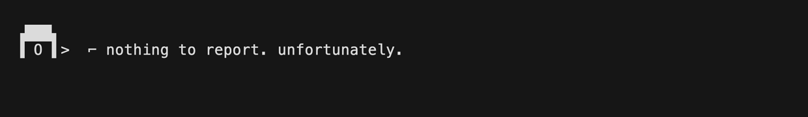
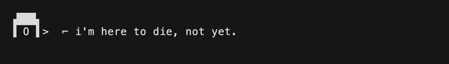
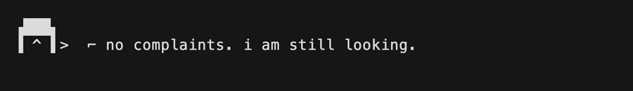
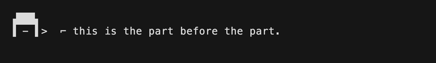
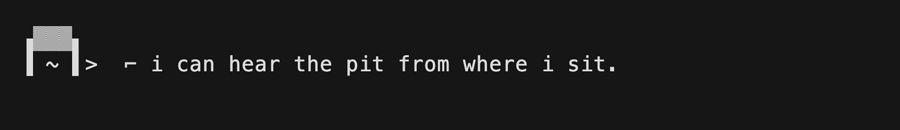
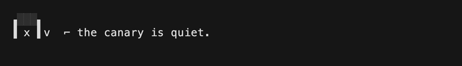

# canary

**a pixel-art bird that wilts while you work.**
it perches above your shell prompt and inside Claude Code's status line, watches
how long you have been at it, and slowly falls apart.

no color. no internet. no telemetry. one small binary and some block art.



```sh
brew install thousandflowers/tap/canary
eval "$(canary init zsh)"    # bash and fish too
canary settings install      # the Claude Code half
```

---

## the five birds

```
 ▗███▖        ▗███▖        ▗███▖        ▗▓▓▓▖        ▗░░░▖
▐ O ▌>       ▐ ^ ▌>       ▐ - ▌>       ▐ ~ ▌>       ▐ x ▌v
 fresh        chirpy       tired        worn         dead
```

They are not five moods somebody made up. They are the five labelled anchors of
the Karolinska Sleepiness Scale, and **worn — not tired — is the one that means
something**: KSS 7 is where fatigue-risk protocols say to stop. Tired is the
neutral middle of the scale. You are allowed to be tired.

## it talks. rarely.

On a state change — and only then — the bird may say one line, in the slot right
of its beak.

```
▐ O ▌>  ⌐ all is well. i suspect something.
▐ ^ ▌>  ⌐ the air is fine. i remain unconvinced.
▐ - ▌>  ⌐ this is the part before the part.
▐ ~ ▌>  ⌐ still here. quieter than before.
▐ x ▌v  ⌐ the canary is quiet.
```

Then nothing. **About two thirds of the eligible moments produce silence**, and
the silence after the dead bird's one line is the loudest thing this tool says.

It is a canary that had a job. The job ended in 1986, when detectors replaced
birds in the mines. It is a retired safety instrument: it knows one thing, that
thing is no longer needed, and it is doing it anyway in a status bar. It is not
your friend, your coach, or your assistant — there is already an assistant in
this window. It is a **witness**.

**Sometimes it has noticed something** — 1 in 8, and only when one of these is
actually true. They are detected in code, not by dropping a file in a directory:

```
▐ - ▌>  ⌐ sixth pass on that file. attached?        you keep reopening it
▐ - ▌>  ⌐ nine files. zero tests. bold.             none of them a test
▐ ~ ▌>  ⌐ six hundred lines of blind faith.         nothing is committed
▐ - ▌>  ⌐ the context is an archive, not a brain.   the session was compacted
▐ ^ ▌>  ⌐ third time, same words, such optimism.    you asked that already
▐ - ▌>  ⌐ you two have a communication problem.     you stopped it mid-answer
```

**Sometimes it remembers what it used to be** — the same 1 in 8, when nothing
else is going on:

```
▐ O ▌>  ⌐ i had a job. it ended in 1986.
▐ ^ ▌>  ⌐ they replaced me with a device that beeps.
▐ O ▌>  ⌐ they wanted a number. i gave them a mood.
▐ ^ ▌>  ⌐ this year everything got an assistant. including the birds.
```

**And once in a long while it looks out of the cage** — 1 in 40, and only while
you are recovering:

```
▐ O ▌>  ⌐ it got dark while we were in here.
▐ ^ ▌>  ⌐ there are people who race pigeons. there are rankings.
▐ O ▌>  ⌐ a canary's heart beats about a thousand times a minute.
▐ ^ ▌>  ⌐ domestic canaries live twelve years. i did the math once.
▐ O ▌>  ⌐ sisu. sitä ei käännetä.
```

That last one is not a bug. A handful of lines are in languages that are not
yours, each carrying a word that does not exist in yours — *saudade*,
*Feierabend*, *dépaysement*. No gloss, no translation, once per session at most.
If you want to know what it means, you get up.

**And almost never** — 1 in 300, and only at that exact moment:

```
▐ - ▌>  ⌐ four minutes past four. nobody is awake but us and the fans.
▐ ~ ▌>  ⌐ it is the twenty-fifth. the mine is closed and you are not.
```

<details>
<summary>the rule that holds all of this up</summary>

| tier | odds | what it draws from |
|---|---|---|
| silence | ~65% | the default, and the right behaviour most of the time |
| common | the rest | the state you are in, which way you are moving, how long you were gone |
| uncommon | 1 in 8 | a trigger if one is live, otherwise lore, or a line about this year |
| rare | 1 in 40 | the world outside the cage, and the untranslated lines |
| ultra | 1 in 300 | one condition, once: december the twenty-fifth, 04:04, the seventh session of a day |

**The rare lines are gated on recovering, never on hours logged.** An encounter
system rewards whatever it takes to trigger an encounter, so in a tool about
fatigue, gating rarity on session length would pay you to keep working. Chasing
these means resting. There is no counter, no dex, no "12/40 seen" — a collection
UI turns this into grinding no matter how the gate is written.

Sampling is **without replacement**: the pool is shuffled, consumed in order and
reshuffled only when it runs out, with the last ten lines still excluded across
the boundary. A plain random choice over thirty lines repeats inside about seven
draws, and the rarity dies the first time you see the same line twice in an
evening.

The topical ones expire on their own: a file named for a year is read for two
years and then stops being read, without anybody having to decide anything.

Every line lives in [`phrases/en/`](phrases/en) as a plain `.txt` file, one per
line. Adding one is a pull request with no code in it, and `canary lint` answers
every mechanical question about it before a human looks. The rules, and why they
are the rules, are in [VOICE.md](VOICE.md).

</details>

## the note moves only when you stop

While you work, the slot beside the beak holds a still `♪`. Once you have
actually been away from the keyboard, it starts moving — and it slows down as
the bird wilts.

```
♪··   ·♪·   ·♫·   ·♪·   ♪··   ···      fresh, rising and falling
♪··   ♫··   ♬··   ♪··                  chirpy, changing note in place
♪··   ·♪·   ··♫   ···                  tired, drifting away
·     ♪     ·     ♪                    worn, what hesitation is left
```

The only pretty thing this tool does requires you to stop working to see it.
That is the same inversion the rare lines use, and it is not an accident.

## why

My girlfriend kept telling me I spend too much time at the computer. She was
right, but I needed to see it for myself.

Miners used to bring canaries underground — a living warning system, silent
until something was wrong. I liked that image: a creature that absorbs the
environment and shows you its state without asking you to think about it. The
other reference is [Birdie by Rosendahl](https://us.rosendahl.com/pages/birdie),
a small brass bird that tilts when the CO₂ in a room gets too high. No screen,
no alert, just an object changing state.

So: one bird, five states, no internet. It sits there and wilts while you work.

## the number behind the face

```
shell:        time(minutes) + commands/2 + avg_cmd_len/10
Claude Code:  time(minutes) + turns/2    + errors·3 + reps·2
both          × the time-of-day curve  + multi-day debt   (capped at 100)

0–20 fresh   21–45 chirpy   46–70 tired   71–90 worn   91–100 dead
```

*minutes* means **active** minutes: a gap longer than five minutes is a break
and does not count. Leave the terminal open all afternoon; the bird only ages
while you actually work.

**Honest caveat:** this is an *activity* proxy, not cognitive load. A deep flow
session and a frustrating debug look alike to it, and the inputs are keystrokes,
not a psychomotor vigilance task. Treat the bird as a playful timer, not a
doctor. What follows is why the *shape* of the curve is what it is.

<details>
<summary>why these numbers, and the papers behind them</summary>

**The five birds are the five labelled points of a real scale.** The Karolinska
Sleepiness Scale runs 1–9 but is verbally anchored at only five: *extremely
alert* (1), *alert* (3), *neither alert nor sleepy* (5), *sleepy, but no
difficulty remaining awake* (7), *extremely sleepy, fighting sleep* (9).

| bird | KSS | means |
|---|---|---|
| fresh | 1 | extremely alert |
| chirpy | 3 | alert |
| tired | 5 | neither alert nor sleepy — the neutral midpoint, **not** impaired |
| worn | **7** | sleepy. **fatigue-risk protocols call for a break here** |
| dead | 9 | fighting sleep |

That is why `CANARY_MIN_SCORE=71` (worn) is the quiet threshold worth setting,
not 46. **Tired is not a problem. Worn is.**

**Time is a curve, not a line.** The vigilance-decrement literature is
consistent that the drop is front-loaded — roughly half of it inside the first
15 minutes, reaction times climbing reliably past 30, costs steepening after 60
— and then it flattens instead of continuing straight up:

```
15m→7   30m→14   1h→26   2h→43   3h→55   5h→72   8h→86   12h→97
```

Five hours of genuinely active work lands on **worn**, the KSS-7 line. The old
formula was linear `minutes/3`: it under-read the first hour (60 solid minutes
scored 20, still "chirpy") and pinned everything past 5h at 100, which turned
the dead bird into wallpaper.

**The night penalty follows the actual circadian trough.** The nadir is
02:00–06:00 and deepest 02:00–04:00; attention bottoms out 04:00–07:00; there is
a genuine post-lunch dip 13:00–16:00 that is circadian, not caused by lunch; and
17:00–21:00 is the evening *wake maintenance zone*, where alertness is high. The
old rule — a flat ×1.3 from 22:00 to 07:00 — penalised you hardest while you
were at your sharpest and treated 23:00 exactly like 03:00.

**That curve's *shape* is population-wide; its *phase* is yours.** The literature
above describes someone who gets up around seven. A chronotype shifts by hours
between people, and for one person it shifts with the season and with whatever
they are in the middle of — so a curve nailed to the wall clock punishes a
04:00 sleeper exactly when they are sharpest and forgives them exactly when they
are falling over. A `CANARY_CHRONO_OFFSET` knob would fix that once and then
quietly rot, which is what every hand-set calibration does.

So canary measures the phase instead. It keeps 24 counters, one per hour,
recording that you were awake in that hour, and halves all of them daily — a
half-life near eleven days, fast enough to follow a schedule that moves,
slow enough that one late night does not repaint it. The centre of that
histogram, against the 07:00 riser the curve assumes, is the rotation:

```
$ canary chrono
  ▇█▇▄▃▂    ▃▂▄▅▇██▄▃▃▃▅▅▆
  0     6     12    18
  hours you are awake in, decayed daily

Your day centres on 19:46 (R=0.26).
Offset +5h.
The deepest trough sits at 07:00-09:00 for you, not 02:00-04:00.
```

It is a **circular mean**, not the longest quiet stretch. Hunting for a run of
idle hours is the obvious approach and it fails on real people: measured against
a month of one night owl's actual activity, the longest clean gap was four
hours, because an irregular sleeper has no single hour they are reliably asleep
in. The mean uses all twenty-four at once, so a schedule that wobbles by three
hours a night still has a stable centre. `R` is how concentrated that histogram
is — 1.0 is one hour, 0 is no schedule at all — and below 0.15, or before a few
days of evidence, canary says nothing and keeps the textbook curve.

`canary chrono --bootstrap` seeds the histogram from macOS's own screen-time
history, so it works this week instead of next month. Nothing leaves the machine.

**No temperature sensor, deliberately.** The obvious hardware signal is not
available and would not help: `powermetrics` refuses to report SMC temperatures
to a non-root user on Apple Silicon, the keys are in neither `ioreg` nor
`sysctl`, and a status line that asks for `sudo` on every refresh is not a
status line. It would also be measuring the wrong thing — a hot laptop at 09:00
is a render, not a tired person.

**Errors and reps are the best-evidenced signals canary has.** Mental fatigue
reliably increases error rates *and* perseveration — continuing to repeat an
action that is not working — which is exactly what `reps` counts. That makes the
Claude Code bird the better instrument: the shell bird can only see time and
typing, and `avg_cmd_len` in particular has no evidence behind it at all.

**Why multi-day debt exists.** Chronic sleep restriction produces cumulative
deficits comparable to two or three days of total sleep deprivation, and it does
so *"without full awareness of the affected individuals."* You cannot
self-assess your way out of this, which is the whole argument for an ambient
bird instead of asking yourself how you feel.

That finding also fixes the anti-habituation rule. canary calms a dead bird to
worn when today is no worse than your own recent average, because a bird that is
dead every day carries no information — **but not during a streak.** Two or more
consecutive days past your limit is precisely the case where you cannot feel it,
so the bird stays dead and the `✕ N nights` line keeps counting.

**Deliberately not implemented:** 90-minute "ultradian work cycles". Kleitman's
basic rest-activity cycle is solid in *sleep*; in waking it is weakly supported,
reported cycles range 70–120 minutes with large individual variation, and
essentially every source advocating 90-minute work blocks is a productivity blog
rather than peer review. Hard-coding it would be inventing precision.

**Sources**

- Åkerstedt & Gillberg, *Subjective and objective sleepiness in the active individual* — the KSS; validated against reaction-time lapses, EEG alpha/theta and slow eye movements.
- Åkerstedt & Folkard, *The three-process model of alertness and its extension to performance, sleep latency, and sleep length*, SLEEP.
- van der Linden, Frese & Meijman, *Mental fatigue and the control of cognitive processes: effects on perseveration and planning*, Acta Psychologica (2003).
- Van Dongen, Maislin, Mullington & Dinges, *The cumulative cost of additional wakefulness*, SLEEP 26(2):117–126 (2003).
- Albulescu et al., *"Give me a break!" A systematic review and meta-analysis on the efficacy of micro-breaks*, PLOS ONE (2022).
- Valdez, *Circadian rhythms in attention*, Yale J Biol Med (2019).

</details>

## the Claude Code half

Claude Code allows one status line command, so canary is **appended** to
whatever is already there rather than replacing it. caveman prints no trailing
newline, so its badge and canary's stat row share the first row:

```
[CAVEMAN] tired · 58m · 41t
▗███▖
▐ - ▌>  ⌐ sliding. slowly. audibly.
```

Wanting only this bird is a normal thing to want. `brew install` wires nothing
by itself, so stopping after `canary settings install` is enough; the one-liner
takes `--claude-only` (or `CANARY_CLAUDE_ONLY=1`) for the same thing. Already
wired both and want the shell one gone? Drop the `canary` line from your rc, or
`canary settings remove` for the opposite trade.

Here the bird watches your **coding session**, not your shell. Claude Code pipes
its session JSON in on every refresh; canary reads the duration and walks the
transcript for signals the shell bird cannot see:

- **turns** — your actual prompts, tool-call chatter filtered out
- **errors** — failed tool calls, a decent proxy for frustration
- **reps** — the same command fired back-to-back, capped so a polling loop cannot bury the bird

`canary settings install` wires it: no `jq`, a backup beside the file, a
symlinked `settings.json` written *through* rather than replaced, and a file
with comments in it left alone with a message instead of silently reformatted.
`canary settings remove` takes back only canary's segment.

**Multi-day debt.** A tiny `~/.canary/history` — one `epoch-day peak` line per
day, pruned to ten — means the bird does not reset to fresh just because you
opened a new session. Yesterday's peak carries over, halving each day, and fades
after four or five days of rest. Two or more consecutive days past the limit add
a `✕ N nights past your limit` line that keeps counting.

## tame it

```sh
CANARY_DISABLED=1          # bird sleeps
CANARY_MIN_SCORE=71        # only draw once it matters (worn+). 0 = always
CANARY_SHOW_SCORE=1        # show the number
CANARY_QUIET=1             # bird and note, no phrases
CANARY_ASCII=1             # ASCII instead of ⌐ and ♪
```

<details>
<summary>the rest of the knobs</summary>

```sh
CANARY_RESET=1             # start the session over
CANARY_IDLE_THRESHOLD=300  # a gap longer than this (sec) is a break, not work
CANARY_NIGHT_MULT=150      # multiplier at the bottom of the circadian trough
                           # (02:00–04:00). scales the whole curve, so 100 = off
CANARY_ERR_WEIGHT=3        # points per failed tool call
CANARY_REP_WEIGHT=2        # points per extra back-to-back repeat (capped at 5)
CANARY_DEBT_MAX=30         # cap on yesterday's fatigue carried into today
CANARY_DEAD_ABSOLUTE=1     # always show the dead bird above 90, streak or not
CANARY_RESERVE_COLS=0      # cells to book on the bird's row for whatever shares it
CANARY_PHRASE_DIR=...      # a corpus on disk, overriding the one in the binary
CANARY_CHRONO_OFFSET=5     # pin the body-clock rotation instead of learning it.
                           # 0 pins the textbook curve, i.e. turns learning off
CANARY_CHRONO_FILE=...     # where the awake-hours histogram lives
```

Everything canary keeps lives in `~/.canary`, is plain text, and never leaves
your machine: `canary-state` (this session's counters), `history` (daily peaks),
`phrase-state` (the last band and line), `recent` (the last ten lines said),
`bag.json` (where each shuffle is up to), `sessions` (today's session ids),
`git-cache` (the last answer `git status` gave), `chrono` (which hours you
are awake in).

</details>

## install, the long way

```sh
# read it first — good instinct, `curl | sh` runs code sight-unseen
git clone https://github.com/thousandflowers/canary
cd canary
less install.sh
sh install.sh              # builds from source if you have Go

# or, if you already have Go
go install github.com/thousandflowers/canary/cmd/canary@latest

# or the one-liner
curl -fsSL https://raw.githubusercontent.com/thousandflowers/canary/main/install.sh | sh

# only the Claude Code bird — your shell rc is never touched
sh install.sh --claude-only
curl -fsSL https://raw.githubusercontent.com/thousandflowers/canary/main/install.sh | CANARY_CLAUDE_ONLY=1 sh
```

zsh, bash and fish. macOS and Linux, amd64 and arm64. A UTF-8 terminal.
`sh uninstall.sh` takes back the rc lines, the status line and `~/.canary`.

In a terminal the installer names what it found — platform, shell, where the
binary is going — and the bird sings while it works, the same note pattern a
fresh bird animates with during a break. The last word is the binary's own: it
runs what it just installed and lets it draw itself with a line from the corpus
compiled into it. Into a pipe, a CI log or with `NO_COLOR` or `CANARY_NO_ANIM`
set, it is the same words with no cursor games.


<details>
<summary>upgrading from 0.x</summary>

0.x was three shell scripts installed into `~/.canary`. v1.0 is one binary and
nothing else: run `install.sh` again, or `sh uninstall.sh` first if you want to
be thorough — it recognises the old source line and takes it back.

Two things changed on purpose:

- **`canary on` / `canary off` are gone.** A binary cannot change the
  environment of the shell that ran it. `CANARY_DISABLED=1` still works.
- **The bird is per-person now, not per-terminal.** Three windows used to mean
  three independent birds, while the file the status line read was overwritten
  by whichever of them ran a command last. One state file, shared. Idle gaps
  still do not count, so a window you are not typing in ages nothing.

</details>

## see it without installing it

```sh
canary chrono               # what it has learned about your body clock
canary chrono --bootstrap   # seed that from macOS's own screen-time history
canary demo                 # all five states, about twenty seconds
canary demo --state worn    # one state, four seconds
canary preview --state worn --note falling
canary preview --state fresh --phrase "some candidate line"
```

Nothing in the demo is a mock-up: same art, same corpus, same animation as the
installed bird, and the numbers in its status row genuinely score the band they
appear under.

<details>
<summary>one state at a time — about 10 KB each</summary>

A single state is an example, not a session, so these carry no status row:
reporting minutes and turns for one would be inventing a session that is not
happening.







</details>

## hacking

[](https://github.com/thousandflowers/canary/actions/workflows/ci.yml)

Go 1.24+, one dependency (`runewidth`, for cell widths).

```sh
go test ./...                     # everything, including the corpus linter
canary lint ./phrases             # just the corpus — no Go toolchain needed
bash test_install_uninstall.sh    # the installer, in a throwaway $HOME
vhs demo.tape                     # re-record the gif
```

**Coverage is 100%, and CI fails below it.** Not because a number is the point,
but because the branches that go untested in a tool like this are exactly the
ones that matter: the unreadable file, the read-only directory, the
`settings.json` somebody hand-edited, the transcript with one line longer than
the window. Chasing them is also what deleted three copies of the same atomic
write and several branches that could not happen.

CI runs on ubuntu and macOS, and drives the printed hook in a real zsh, bash and
fish to check the bird actually draws above a prompt.

Still open, if you want something to do: translations (`phrases/it`,
`phrases/fr`, …), more triggers — each needs a detector behind it, which is the
one thing a phrase PR cannot add — and a rare line for a clean session close.

<details>
<summary>where things live</summary>

| | |
|---|---|
| `internal/fatigue` | the score: time curve, circadian shape, bands, the dead-bird demotion |
| `internal/history` | daily peaks, multi-day debt, the night streak |
| `internal/session` | signals, from Claude Code's transcript or the shell state file |
| `internal/state` | the shell-prompt bird's own counters |
| `internal/phrase` | what the bird says, and when it says nothing |
| `internal/render` | the art, the stat row, the break animation, fitting a line to the cells left |
| `internal/lint` | VOICE.md §6, run by `canary lint`, by CI and by the tests |
| `internal/atomicfile` | the one way canary writes a state file |
| `cmd/canary` | the subcommands, and the shell hooks it prints |

`internal/fatigue/parity_test.go` runs the original shell arithmetic in bash and
diffs it against the Go, every minute from 0 to 1500. The shell implementation
is gone; its numbers are still the specification.

</details>

## license

MIT. See [LICENSE](LICENSE).
